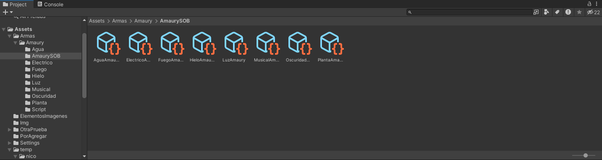
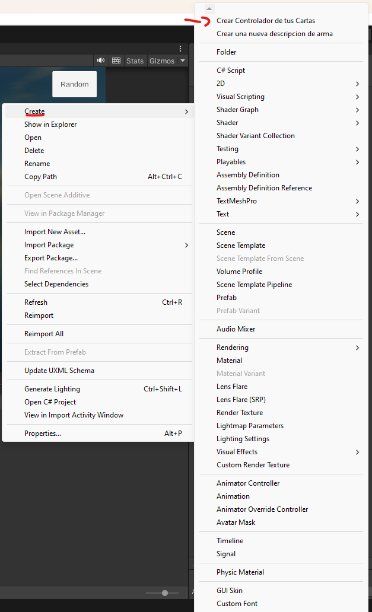
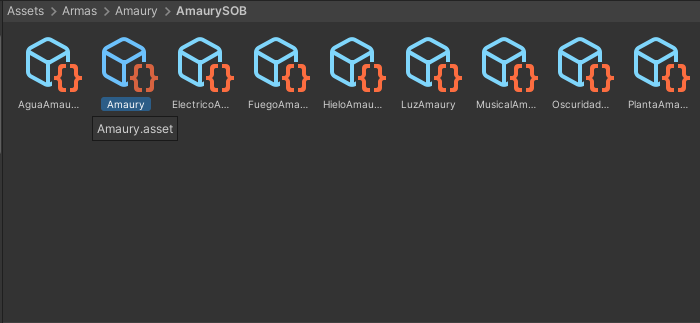
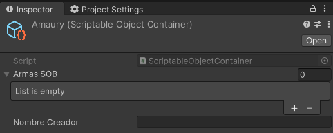
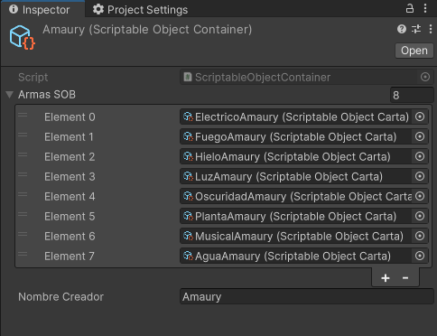
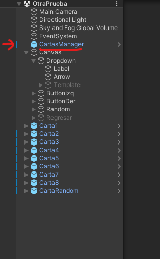
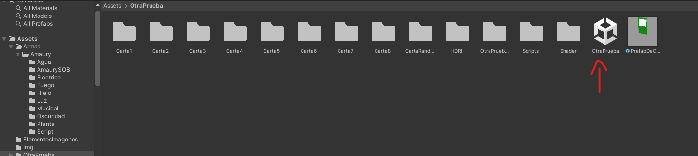
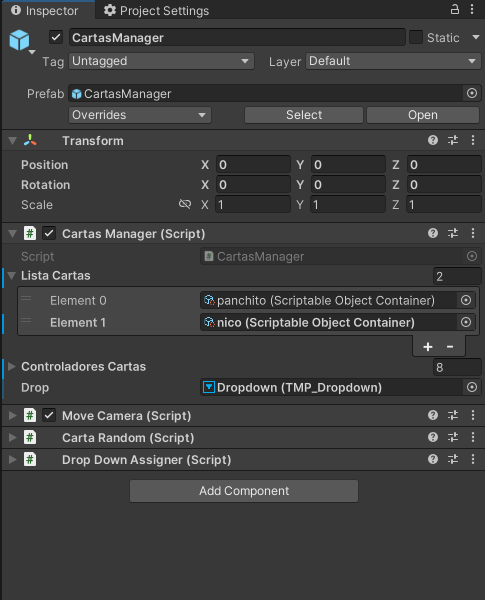
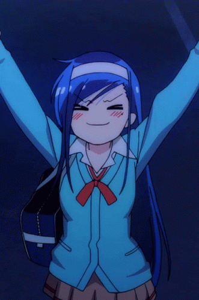

# Instrucciones para agregar tus armas
Hola :D 
Ya de primeras me disculpo por lo extenso que es documento, pero traté de ser lo más detallista posible 
De favor les pido:
- No toquen nada de la escena o de los componentes más allá de lo que especifico en el documento
- Traten de leer todo el documento al mismo tiempo que van haciendo los pasos, puede ser tedioso, pero es para agilisar el proceso y tratar de evitar problemas comunes
- Si hacen todo completamente como en las instrucciones y no sirve avisenme pls
- Si sale un error de _mergeo_ solo avisenme y yo lo corrijo
- De ultimo recordarles que esto es calificación grupal c:
 ## Como Preparar tus armas para exportar
 Para empezar vamos a abrir el proyecto donde tienes tus armas _(el proyecto que le enseñaste a rojo)_  
 Ahora necesitamos crear un cubo, resetamos su transform, y modifcamos su escala con 1, 5.5 , 8
 
 
Tendrán este cubito
 
### Esta será la pantalla que tendrán para mostrar su arma 
Ahora el caso es tratar de meter tus armas dentro de este cubo 
Para saber que estamos viendo del lado correcto, la _Z_ de nuestro navegador debe de estar a la derecha 
 
Ahora tenemos que ajustar nuestra arma 
por ejemplo, pongamos mi arma y esto serán errores comunes:
- El arma no está en 0,0,0
- Está gigante
- Está Rotada
- No está cerca del cubo

 
### TODOS ESTOS DETALLES HARÁN QUE TU ARMA NO SE VEA
Ahora vamos a corregirlo 
**Primero** vamos resetear el transform del arma

 
Todavia no está dentro del cubo 
ahora manualmente trata de que tu arma este dentro del cubo _(Recuerden que la "Z" del navegador esté a la derecha)_

 

Si por algun motivo el arma queda un tantito más afuera del cubo, solo por si acaso les recomiendo meterlo tantito

Perfecto, ahora creamos el prefab del arma lo que acabamos de hacer _Solo arrastra el gameobject a la carpeta_

.gif)
## Como éxportar
Ahora para exportar les voy a pedir un poco más de cuidado, ya que se pueden llegar a exportar codigos o dependencias innecesarias que pueden hacer que el proyecto se muera 
No lo digo por mala onda pero es probable que algunos tengamos un desastre en el proyecto, y esto también se exportará 
Para evitar que esto llegue al otro proyecto y luego tengamos problemas para encontrar cosas, o se haga un despapaye, vamos a hacer lo siguiente: 
**Empezamos por crear una carpeta con nuestro nombre**

 
Ahora vamos a empezar a meter cosas 
Les recomiendo crear carpetas con los nombres de los elementos adentro

 

Ahora empiecen a pasar todo lo que necesiten dentro de estas carpetas 
Probablemente tengan que pasar:
- Modelo del arma
- Shader Graphs
- Materiales
- Animaciones
- Prefab del arma que crearon antes

Esta lista solo es una sugerencia, si su arma necesita algo más de lo que puse en la lista, metanlo también 
Lo que trato de decir:
> Mete todo lo que tu arma necesite y deja fuera todo lo que no es necesario

Por ejemplo mi arma de hielo necesita esto:
 

Ya con esto, no debería pasarle nada al momento de exportarla 
Lo que sigue es repetir el proceso hasta terminar todas sus armas  
**Una vez terminadas todas las armas, ahora si, es momento de exportar** 
Nos dirigimos en la parte de arriba En Assets>Export Package...
 

### CHECAMOS QUE SOLO IMPORTEMOS LA CARPETA CON NUESTRO NOMBRE
Si por algun motivo aparecen más carpetas que no sean la de nuestro nombre, **ESTÁ MAL** 
Como en el siguiente caso:

Aparece la carpeta con mi nombre pero también otras más 
Esto puede deberse por 2 posibilidades:
- No metiste todo lo que necesitaba tu arma y estos son arhcivos que te hacen falta
- Son dependencias de unity o similares

**¿Cómo las diferencio?** 
Pues tendrás que checar que cosas le faltan a tus armas y que no 

En caso de comprobar que a tus armas no les falta nada, y aún así sigan apareciendo carpetas, probablemente sean dependecias, lo único que hacemos es deseleccionarlas 

 

Ahora le asignamos un nombre y lo guardamos

Genial, ahora ya tenemos nuestro paquete exportado, solo faltan 2 pasos
## Cómo importar
Para empezar vamos a importar nuestras armas 
Para ello vamos a Assets>Import Package...>Custom Package...

Seleccionamos el paquete que creamos

Nos saldrá esta ventana, solo le damos en import

Deberia aparecer la carpeta con su nombre, porfa, **Pasenlo dentro de la carpeta _Armas_**

.gif)

Ahora dentro de la carpeta con tu nombre, crea un nueva carpeta 
De preferencia que se llame como _Tú Nombre + SOB_ 
En mi caso es `AmaurySOB`

Genial, ahora solo falta agregar tus armas

## Cómo agregar las armas
Dentro de su carpeta con terminacion _SOB_ damos click derecho en create > Crear una nueva descripcion de arma

Nos creará este archivo:

De preferencia que el nombre del arma sea de la que van a describir

Ahora, al seleccionar el objeto dentro del inspector aparecerá lo siguiente:

Los campos son los siguientes:

-   Carta Nombre
    - `Tipo String` Es el nombre de tu arma
- Elemento
    - `Tipo Sprite o imagen` Es la imagen del elemento de la carta _(más adelante te explico donde agragarlo)_
- Habilidad Nombre
    - `Tipo String` Es el nombre de la habilidad de tu arma
- Habilidad Descripción
    - `Tipo String` Es la descripción de lo que hace la habilidad de tu arma
- Arma descripción
    - `Tipo String` Es la historia_Lore_ de tu arma
- Nombre Persona
    - `Tipo String` Es tu nombre
- Carta Color
    - `Tipo Color` Es el color que quieres que tenga tu carta
- Modelo Arma
    - `Tipo GameObject` Aquí va tu prefab

Empezamos a rellenar todos los espacios, en el caso del _Elemento_, podemos encontrar las imagenes en `Asstes/ElementosImagenes` 
**FAVOR DE PONER LA IMAGEN DE _OTHER_ PARA LAS 2 ARMAS DE TEMÁTICA ESPECIAL**

 

En el caso de Modelo Arma, fijense muy bien que metieron el prefab y no el modelo:

Cuando lleguemos a _modelo arma_ tienes que buscar tu **prefab del arma**, no el modelo 
**Un consejo para que sea más fácil: en el inspector, en los 3 puntos, da click en _Properties..._ soltará una ventana flotante que te dejará navegar entre los archivos**

### PORFAVOR RELLENEN TODOS LOS CAMPOS
Porque si no se van a tronar el programa 

Cuando terminen debería de verse algo parecido a esto:

Genial, ahora hacemos eso con todas nuestras armas 
Cuando acabemos tendremos algo parecido a esto:

### PORFAVOR LES REPITO QUE COMPRUEBEN QUE TODOS LOS CAMPOS ESTEN COMPLETOS

Ahora tenemos que crear un controlador 
En la misma carpeta donde creamos las descripciones, en mi caso `AmaurySOB`, vamos a crear un controlador para las cartas 
Damos click derecho en la carpeta, luego en create > Crear controlador de tus cartas

Una vez creado, de preferencia poner su nombre para que sea más identificable

En el inspector aparecerá lo siguiente:

- Armas SOB
    - `Tipo ScriptableObject` Aquí hay que meter todas las descripciones de las armas en el orden que queremos que aparezcan
- Nombre creador
    - `Tipo String` Aquí deben de poner su nombre _(Solo pongan su primer nombre o algo que los identifique)_

Al final tendriamos que tener algo parecido a esto:

Buscamos CartasManager en la escena de unity

**En dado de caso de que al cargar el proyecto esten en otra escena se encuentra en Assets > OtraPrueba > OtraPrueba> OtraPrueba**

Al seleccionarla, en el inspector aparecerá algo parecido a esto: 
_Panchito y nico son nombres temporales para ejemplo_

Solo tienen que agregar el controlador que acaban de crear con su nombre al apartado **Lista Cartas**

### NO TOCAR NADA MAS QUE _LISTA CARTAS_

.gif)

## Y terminaste! Si hiciste todo correcto y con todos los pasos, tus cartas ya se muestran

**Cualquier error que encuentres hazmelo saber porfi**