# Instrucciones para agregar tus armas
 ## Como Preparar tus armas para exportar
 Hola :D 
 Para empezar vamos a habrir el proyecto donde tienes tus armas _(el proyecto que le enseñaste a rojo)_  
 Ahora necesitamos crear un cubo, resetamos su transform, y modifcamos su escala con 1, 5.5 , 8
 
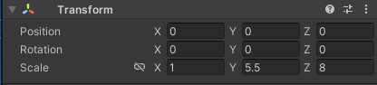 
Tendran este cubito
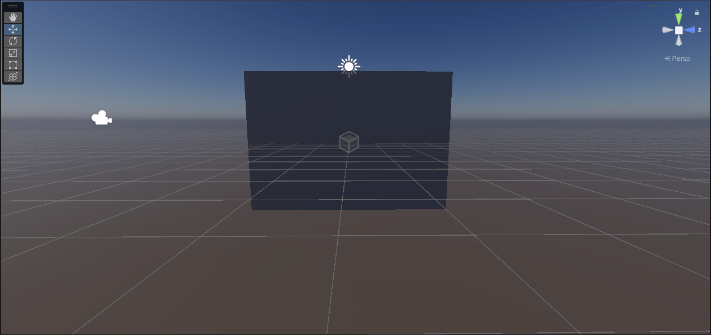 
### Esta sera la pantalla que tendran para mostrar su arma 
Ahora el caso es tratar de meter tus armas dentro de este cubo 
Para saber que estamos viendo del lado correcto, la "Z" de nuestro navegador debe de estar a la derecha 
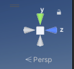 
Ahora tenemos que ajustar nuestra arma 
De ejemplo pongamos mi arma y esto sera algo común:
- El arma no esta en 0,0,0
- Esta gigante
- Esta Rotada
- No esta cerca del cubo

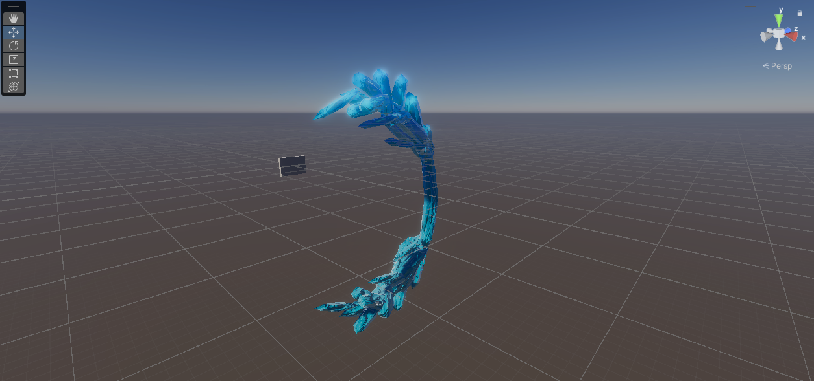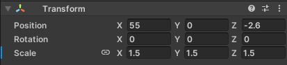 
### TODOS ESTOS DETALLES HARÁN QUE TU ARMA NO SE VEA
Ahora vamos a corregirlo 
**Primero** vamos resetear el transform del arma

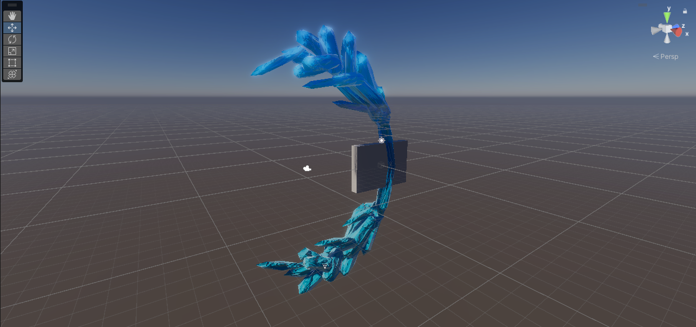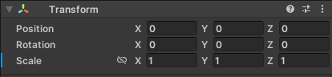 
todavia no esta dentro del cubo 
ahora manualmente trata de que tu arma este dentro del cubo _(Recuerden que la "Z" del navegador este a la derecha)_

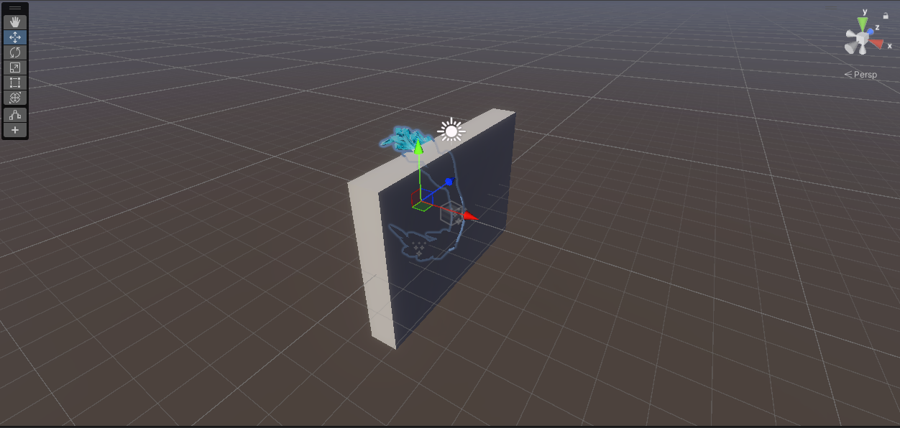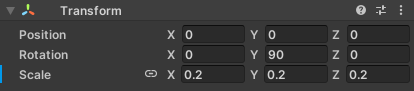 

Si por algun motivo el arma queda un tantito más afuera del cubo, solo por si acaso les recomiendo meterlo tantito

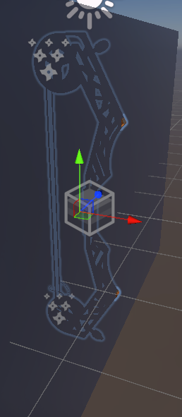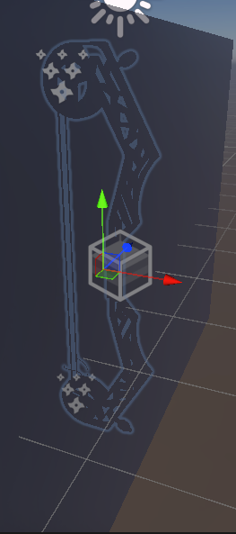

Perfecto, ahora creamos el prefab del arma que tenemos crear el prefab de lo que acabamos de mover

.gif)
## Como exportar
Ahora para exportar les voy a pedir un poco más de cuidado, ya que se pueden llegar a exportar codigos o dependencias inecesarias que pueden hacer que el proyecto se muera 
No lo digo por mala onda pero es probable que algunos tengamos un desastre en el proyecto, y esto tambien se exportara 
Para evitar que esto llege al otro proyecto y luego tengamos problemas para encontrar cosas o se haga un despapaye vamos a hacer lo siguiente: 
**Empezamos por crear una carpeta con nuestro nombre**

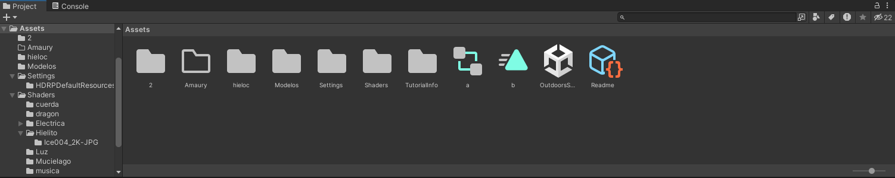 
Ahora vamos a empezar a meter cosas 
Les recomiendo crear carpetas con los nombres de los elementos adentro

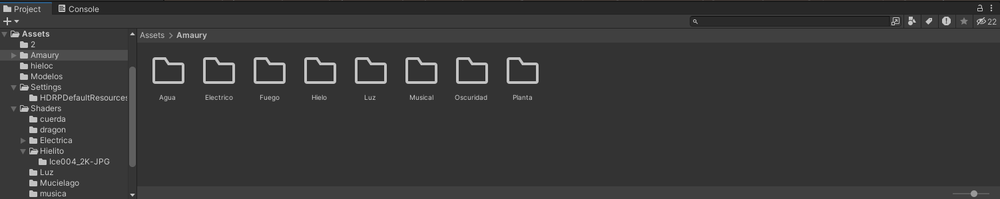 

Ahora empiezen a pasar todo lo que necesiten dentro de estas carpetas 
Probablemente tengan que pasar:
- Modelo del arma
- Shader Graphs
- Materiales
- Animaciones
- Prefab del arma que crearon antes

Esta lista solo es una sugerencia, si su arma necesita algo mas de lo que puse en la lista, metanlo también 
Lo que trato de decir:
> Metan todo lo que tu arma necesite y deja fuera todo lo que no es necesario

Por ejemplo mi arma de hielo necesita esto:
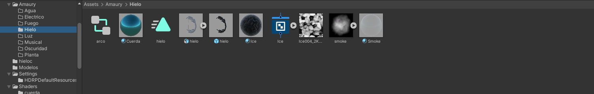 

Ya con esto, mi arma no deberia de pasarle nada al momento de pasarla al otro proyecto 
lo que sigue es repetir el proceso hasta terminar todas sus armas  
**Una vez Terminadas todas las armas ahora si es momento de exportar** 
Nos dirigimos en la parte de arriba En Assets>Export Package...
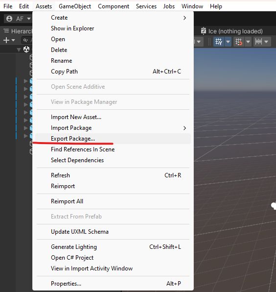 

### CHECAMOS QUE SOLO IMPORTEMOS LA CARPETA CON NUESTRO NOMBRE
Si por algun motivo no solo aparece nuestra carpeta con nuestro nombre **ESTA MAL** 
Como en el siguiente caso:

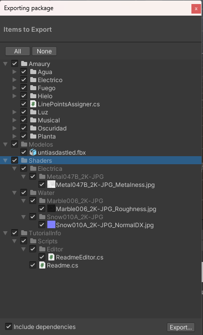

Aparece la carpeta con mi nombre pero tambien otras mas 
En este caso hay de 2
- No metiste todo lo que necesitaba tu arma y en estas carpetas se encuentran
- Son dependencias de unity o similares

**¿Como las diferencio?** 
Pues tendrás que checar cuales de las cosas que faltan si las usan tus armas y cuales no 

En caso de comprobar que a tus armas no les falta nada, y aun asi sigan apareciendo carpetas, probablemente sean dependecias, lo único que hacemos es deseleccionarlas 
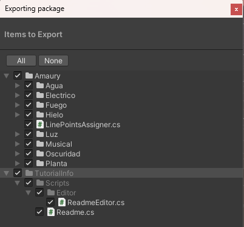
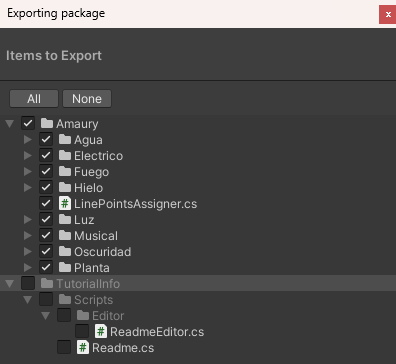 

Ahora le asignamos un nombre y lo guardamos

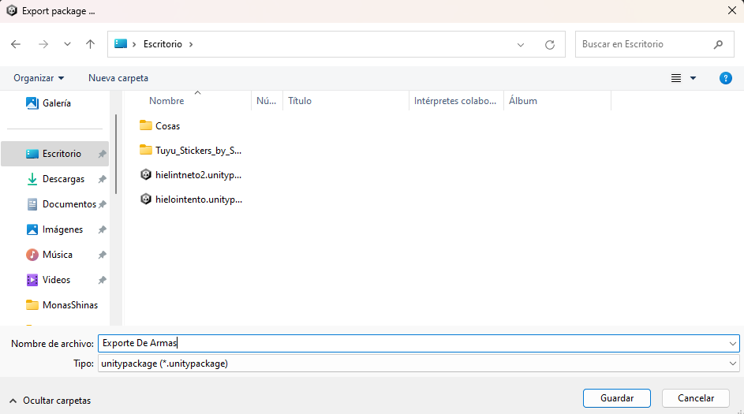

Genial, ahora ya tenemos nuestro packete exportado, solo falta 2 paso más
## Como importar
Para empezar vamos a importar nuestras armas 
Para ello vamos a Assets>Import Package...>Custom Package...

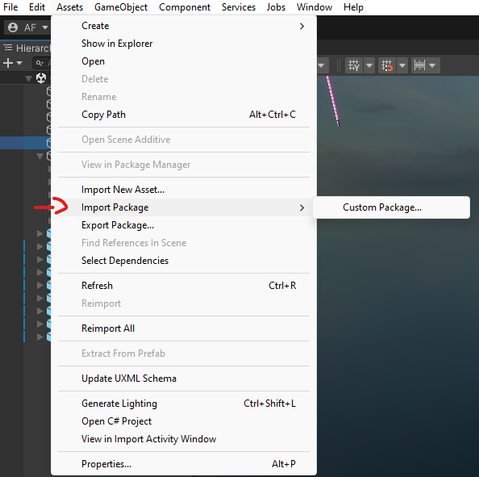

Seleccionamos el que creamos

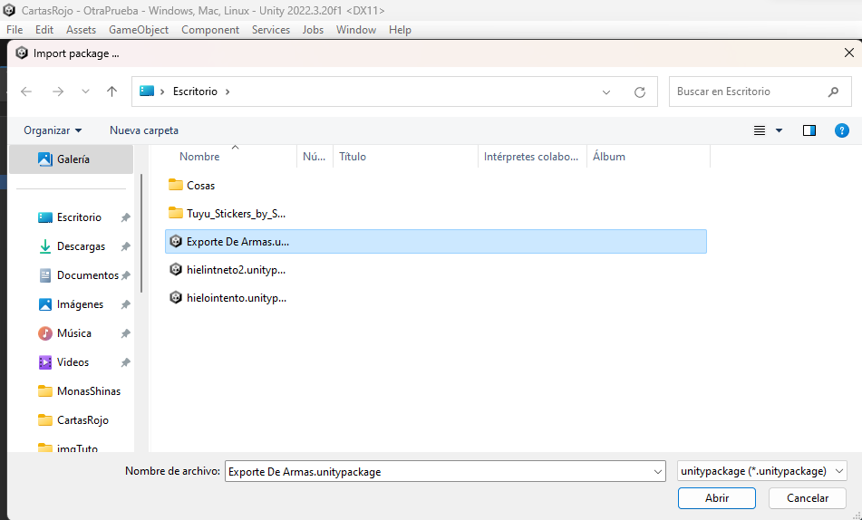

Nos saldra esta ventana, solo le damos a importar

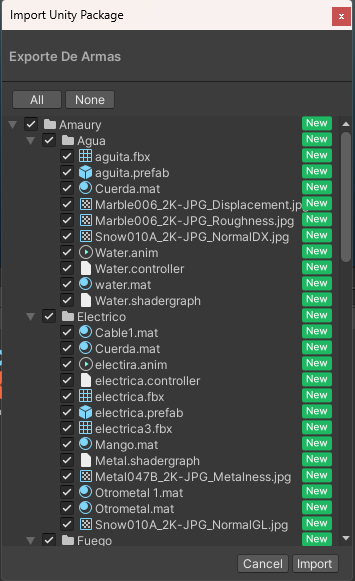

Su carpeta con su nombre deberia aparecer, porfa **Pasenlo dentro de la carpeta _Armas_**

.gif)

Ahora dentro de la carpeta con tu nombre, crean un nueva carpeta 
De preferencia que se llame como tu + SOB 
En mi caso es `AmaurySOB`

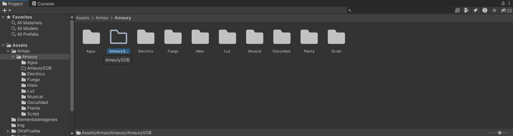

Genial ahora solo falta agregar tus armas

## Como agregar las armas
Dentro de su carpeta con terminacion _SOB_ damos click derecho en create > Crea una nueva descripcion de arma

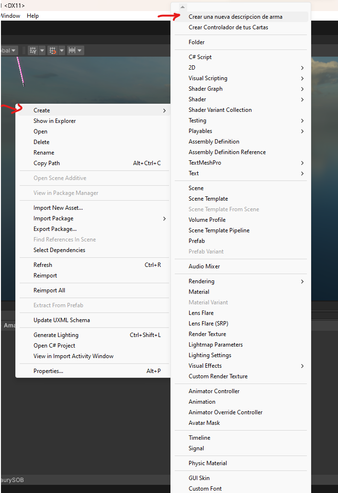

Nos creara este archivo:

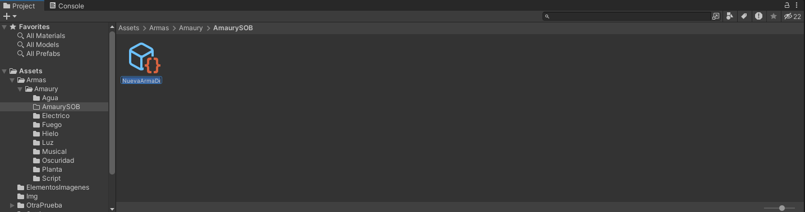

El nombre de preferencia que sea del arma que van a describir

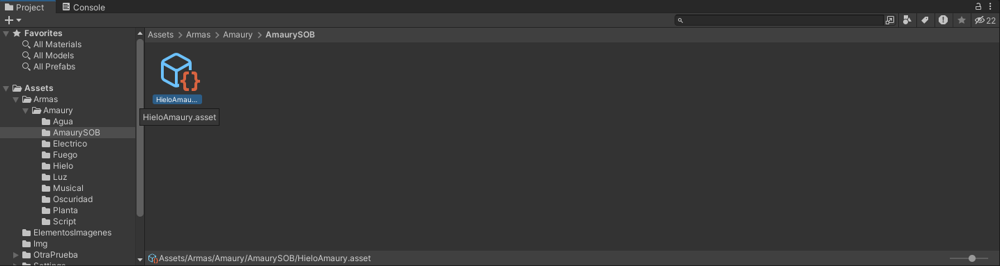

Ahora, al seleccionar el objeto dentro del inspector aparecera lo siguiente:

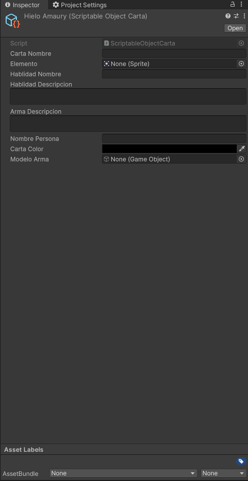

los campos son los siguientes:

-   Carta Nombre
    - `Tipo String` Es el nombre de tu arma
- Elemento
    - `Tipo Sprite o imagen` Es la imagen del elemento de la carta _(más adelante te explico donde agragarlo)_
- Habilidad Nombre
    - `Tipo String` Es el nombre de la habilidad de tu arma
- Habilidad Descripción
    - `Tipo String` Es la descripción de lo que hace la habilidad de tu arma
- Arma descripción
    - `Tipo String` Es el transfondo de tu arma
- Nombre Persona
    - `Tipo String` Es tu nombre
- Carta Color
    - `Tipo Color` Es el color que quieres que tu carta tenga
- Modelo Arma
    - `Tipo GameObject` Aquí va a tu prefab

Empezamos a rellenar todos los espacios, en el caso de Elemento, podemos encontrar las imagenes en `Asstes/ElementosImagenes`

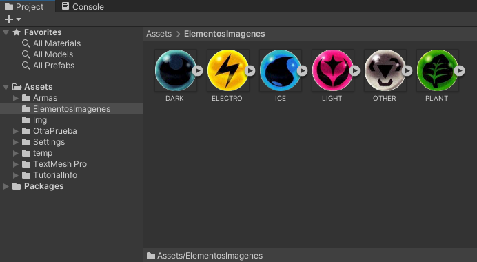 

En el caso de Modelo Arma, Fijense muy bien que metieron el prefab y no el modelo:

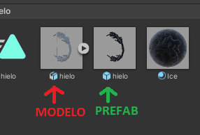

Cuando llegemos a modelo de arma tienen que buscar tu **prefab del arma**, no el modelo 
**Un consejo que puedo para que sea más fácil, en el inspector, en los 3 puntos, da click en _Properties..._ soltara una ventana flotante que te dejara navegar entre los archivos**

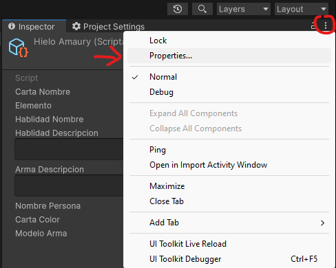

### PORFAVOR RELLENEN TODOS LOS CAMPOS
porque si no se van a tronar el programa 

Cuando terminen debería de verse algo parecido a esto:

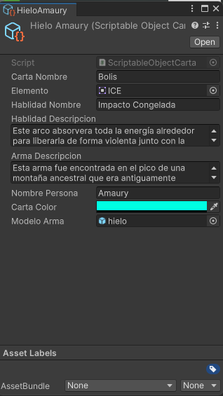

genial, ahora hacemos eso con todas nuestras armas